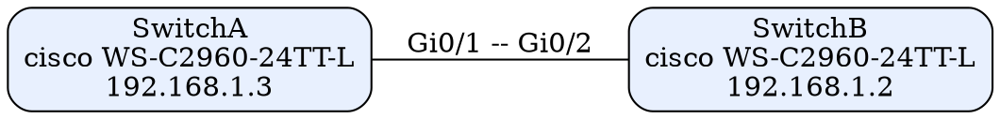

# topo-mapper — Network Topology Mapper

Discover the topology of a Cisco network automatically using CDP,
and render it as structured data plus a Graphviz diagram.

## How CDP discovery works

CDP (Cisco Discovery Protocol) is a Layer-2 protocol that lets directly
connected Cisco devices announce themselves to each other. Every device
keeps a table of its neighbors, visible with:

```
show cdp neighbors detail
```

Each entry contains the neighbor's device ID, management IP, hardware
platform, the local interface, and the neighbor's outgoing interface.
topo-mapper:

1. SSHs into each seed device from the inventory (via Netmiko)
2. Runs `show cdp neighbors detail` and parses every entry with regex
3. Crawls one level deep — discovered neighbors that advertise an IP are
   queried too (unreachable devices are skipped gracefully)
4. Deduplicates bidirectional links (a link seen from both ends is stored once)
5. Writes `topology.json` (nodes + links) and `topology.dot` (Graphviz)

> **Note:** CDP must be enabled on the devices (`cdp run` — it is on by
> default on most Cisco switches/routers). The SSH user needs privilege
> level 15 or an account allowed to run `show` commands.

## Features

- CDP neighbor discovery from seed devices, plus one-level crawl
- Robust parsing: full and abbreviated interface names (`GigabitEthernet0/1`,
  `Gi0/1`, `Fa0/5`, `Te1/0/1`, …) are normalized to a canonical short form
- Handles entries without an IP (e.g. IP phones) and non-standard port IDs
- Bidirectional-link deduplication
- Per-device error handling: auth failures and timeouts are reported,
  discovery continues with the remaining devices
- Outputs: `topology.json` and Graphviz `topology.dot`
- `--no-crawl` mode to query only the seed devices

## Usage

```bash
pip install -r requirements.txt

# 1. Create your inventory from the template
cp devices.example.json devices.json
# 2. Edit devices.json with your real device IPs/names
# 3. Run discovery
python3 topo_map.py

# Custom inventory / output dir / username
python3 topo_map.py --inventory lab.json --out-dir ./out --username admin

# Only query the seed devices, don't crawl neighbors
python3 topo_map.py --no-crawl
```

Render the diagram (requires Graphviz):

```bash
dot -Tpng topology-out/topology.dot -o topology.png
```

## Example `topology.json`

```json
{
  "nodes": [
    {"name": "SwitchA", "ip": "192.168.1.3", "platform": "cisco WS-C2960-24TT-L"},
    {"name": "SwitchB", "ip": "192.168.1.2", "platform": "cisco WS-C2960-24TT-L"},
    {"name": "RouterA", "ip": "192.168.1.1", "platform": "cisco ISR4321/K9"}
  ],
  "links": [
    {"node_a": "SwitchA", "interface_a": "Gi0/1",
     "node_b": "SwitchB", "interface_b": "Gi0/2"},
    {"node_a": "RouterA", "interface_a": "Gi0/0",
     "node_b": "SwitchA", "interface_b": "Gi0/2"}
  ]
}
```

The generated `.dot` file describes the same graph with per-node labels
(name, platform, IP) and per-link interface labels, e.g.:



## Project layout

```
topo-mapper/
├── topo_map.py            # discovery, parsing, output writers, CLI
├── devices.example.json   # inventory template (copy to devices.json)
├── requirements.txt       # netmiko
├── samples/               # realistic `show cdp neighbors detail` captures
├── tests/
│   └── test_parser.py     # self-test: parsing, dedup, JSON/DOT output
├── README.md
├── LICENSE
└── .gitignore
```

## Testing

Live SSH discovery needs real devices, but everything else is tested:

```bash
python3 tests/test_parser.py   # 31 checks: parsing, dedup, JSON, DOT
```

The test feeds two realistic CDP captures through the parser (including
abbreviated interface names, a neighbor with no IP, and a reverse link to
verify deduplication) and validates the generated JSON schema and DOT format.

## Security notes

- `devices.json` (real IPs/hostnames) is git-ignored — only the
  `.example.json` template is committed.
- The SSH password is read with `getpass` and never written to disk.

## Requirements

- Python 3.8+
- netmiko (`pip install -r requirements.txt`)
- SSH access to the target Cisco devices
- Graphviz (`dot`) only if you want to render the diagram

## License

MIT
